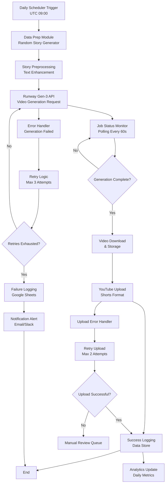

# Make Workflow Blueprint: Automated YouTube Shorts Generation with Runway Gen-3

## Executive Summary

This document outlines a fully automated workflow for generating daily YouTube Shorts using Runway Gen-3 AI video generation. The workflow creates engaging animal rescue story videos with minimal manual intervention and optimized operational costs.

**Key Benefits:**
- Fully automated daily video production
- Cost-effective operation (~25-30 operations per run)
- Scalable content generation
- Comprehensive error handling and logging
- YouTube Shorts optimization

---

## Complete Workflow Architecture

### Mermaid Diagram



---

## Module Breakdown & Data Flow

### 1. Daily Scheduler Trigger
**Module Type:** Make.com Built-in Timer  
**Configuration:**
- **Schedule:** Daily at 09:00 UTC (optimized for global audience)
- **Time Zone:** UTC to ensure consistency
- **Enable:** Always active with holiday bypass option

**Output Data:**
```json
{
  "trigger_time": "2024-01-01T09:00:00Z",
  "execution_id": "exec_12345",
  "date": "2024-01-01"
}
```

**Operation Count:** 1 operation

### 2. Data Prep Module (Randomized Story Generator)
**Module Type:** Make.com Array Iterator / Custom Function  
**Input:** Date and execution ID  
**Process:**
1. Select random animal type from predefined categories
2. Generate story template with randomized elements
3. Enhance story for visual appeal
4. Prepare video prompt for Runway Gen-3

**Story Categories:**
```javascript
const animalCategories = [
  {
    type: "dog",
    scenarios: ["abandoned", "rescued from shelter", "found injured", "saved from flood"],
    locations: ["park", "shelter", "street", "kennel"],
    outcomes: ["adopted", "reunited with owner", "new family", "forever home"]
  },
  {
    type: "cat",
    scenarios: ["stray", "orphaned kitten", "rescued from tree", "medical recovery"],
    locations: ["alley", "veterinarian", "foster home", "adoption center"],
    outcomes: ["loving home", "indoor cat", "barn cat", "companion animal"]
  }
  // Additional categories...
];
```

**Enhanced Story Example:**
```
"Story: A golden retriever named Max was found abandoned in Riverside Park during a storm. 
Rescue volunteers discovered him shivering under a bench, scared but still wagging his tail. 
After three weeks of rehabilitation and love at the local shelter, Max was adopted by the Johnson family. 
Today, he plays happily in their backyard, completely healed and filled with joy. 
This is the power of animal rescue - transforming lives one paw at a time."
```

**Video Prompt for Runway:**
```
"45-second heartwarming video: A golden retriever dog being rescued from a park during rain, 
then recovering in a shelter with caring volunteers, and finally playing happily in a backyard 
with a loving family. Cinematic style, emotional storytelling, professional quality."
```

**Operation Count:** 2-3 operations

### 3. Runway Gen-3 HTTP Module
**Module Type:** HTTP Request  
**Endpoint:** `https://api.runwayml.com/v1/video_generations`  
**Method:** POST  
**Headers:**
```json
{
  "Authorization": "Bearer {{RUNWAY_API_KEY}}",
  "Content-Type": "application/json"
}
```

**Request Body:**
```json
{
  "model": "gen3a_turbo",
  "prompt": "{{enhanced_story_video_prompt}}",
  "duration": 45,
  "ratio": "9:16",
  "resolution": "720p",
  "style": "cinematic",
  "motion_strength": 0.8,
  "seed": "{{random_seed}}"
}
```

**Response Processing:**
```json
{
  "id": "generation_12345",
  "status": "processing",
  "created_at": "2024-01-01T09:00:15Z",
  "estimated_time": 180
}
```

**Operation Count:** 1 operation per API call + polling operations

### 4. Job Status Monitor
**Module Type:** Repeater with HTTP Check  
**Process:**
- Poll Runway API every 60 seconds
- Check generation status
- Timeout after 15 minutes (15 attempts)
- Handle completion/failure scenarios

**Status Check Request:**
```http
GET https://api.runwayml.com/v1/video_generations/{{generation_id}}
Authorization: Bearer {{RUNWAY_API_KEY}}
```

**Possible Statuses:**
- `processing`: Continue polling
- `completed`: Proceed to download
- `failed`: Trigger error handling
- `timeout`: Handle timeout scenario

**Operation Count:** 15 operations (max polling attempts)

### 5. Video Download & Storage
**Module Type:** HTTP Download + Data Store  
**Process:**
1. Download completed video from Runway CDN
2. Store in cloud storage (Google Drive/S3)
3. Generate public sharing link
4. Prepare for YouTube upload

**Download URL Response:**
```json
{
  "id": "generation_12345",
  "status": "completed",
  "output": {
    "url": "https://cdn.runwayml.com/videos/12345.mp4",
    "expires_at": "2024-01-01T10:00:00Z"
  }
}
```

**Storage Configuration:**
- **Primary:** Google Drive folder structure
- **Backup:** Local cloud storage
- **Retention:** 90 days for generated videos
- **Cleanup:** Automated deletion after upload success

**Operation Count:** 2 operations (download + storage)

### 6. YouTube Upload Module (Shorts Format)
**Module Type:** YouTube Connector  
**Process:**
1. Video metadata preparation
2. Upload with Shorts-specific settings
3. Optimization for algorithm
4. Thumbnail generation and upload

**Video Metadata:**
```json
{
  "snippet": {
    "title": "Heartwarming Animal Rescue Story #{{date}} #AnimalRescue #Dogs #Cats #Shorts",
    "description": "{{enhanced_story}}\n\n🔔 Subscribe for daily animal rescue stories!\n#AnimalRescue #AnimalLovers #RescueDogs #RescueCats #Heartwarming #Shorts",
    "tags": ["animal rescue", "dogs", "cats", "heartwarming", "shorts", "adoption"],
    "categoryId": "15",
    "defaultLanguage": "en",
    "defaultAudioLanguage": "en"
  },
  "status": {
    "privacyStatus": "public",
    "selfDeclaredMadeForKids": false
  },
  "recordingDetails": {
    "recordingDate": "{{current_date}}"
  }
}
```

**Shorts Optimization:**
- **Aspect Ratio:** 9:16 (vertical)
- **Duration:** Under 60 seconds
- **Quality:** 720p minimum
- **Audio:** Clear, engaging
- **Hooks:** First 3 seconds critical

**Operation Count:** 1 operation per successful upload

### 7. Error Handler with Retry Logic
**Module Type:** Error Handler + Router  
**Retry Strategies:**

#### Runway Generation Errors
- **Max Retries:** 3 attempts
- **Backoff Strategy:** Exponential (60s, 300s, 900s)
- **Error Types:** API rate limits, generation failures, timeout
- **Fallback:** Skip to next day logging

#### YouTube Upload Errors
- **Max Retries:** 2 attempts
- **Backoff Strategy:** Linear (60s, 300s)
- **Error Types:** Quota exceeded, authentication, file corruption
- **Fallback:** Manual review queue

**Error Classification:**
```javascript
const errorHandling = {
  retryable: [
    "RATE_LIMIT_EXCEEDED",
    "TIMEOUT",
    "TEMPORARY_FAILURE",
    "QUOTA_EXCEEDED"
  ],
  nonRetryable: [
    "INVALID_CREDENTIALS",
    "FILE_CORRUPTED",
    "CONTENT_POLICY_VIOLATION"
  ]
};
```

**Operation Count:** Variable based on retry attempts

### 8. Logging to Data Store
**Module Type:** Google Sheets / Airtable  
**Logging Schema:**

#### Success Log (Google Sheets)
| Date | Execution ID | Story Type | Generation Time | Upload Status | Video ID | URL | Operations Used |
|------|--------------|------------|-----------------|---------------|----------|-----|-----------------|
| 2024-01-01 | exec_12345 | Dog Rescue | 180s | Success | abc123 | youtube.com/watch?v=abc123 | 27 |
| 2024-01-02 | exec_12346 | Cat Rescue | 165s | Success | def456 | youtube.com/watch?v=def456 | 25 |

#### Error Log
| Date | Execution ID | Module | Error Type | Error Message | Retry Count | Resolution |
|------|--------------|--------|------------|---------------|-------------|------------|
| 2024-01-03 | exec_12347 | Runway | RATE_LIMIT | API quota exceeded | 3/3 | Skipped |
| 2024-01-04 | exec_12348 | YouTube | AUTH_TOKEN | Invalid refresh token | 2/2 | Manual intervention |

**Operation Count:** 1 operation per logging event

---

## Operations Budget Analysis

### Daily Operation Breakdown
| Module | Base Operations | Retry Max | Total Max |
|--------|----------------|-----------|-----------|
| Scheduler Trigger | 1 | 0 | 1 |
| Data Prep | 2-3 | 0 | 3 |
| Runway API (Initial) | 1 | 0 | 1 |
| Polling (Status Check) | 15 | 0 | 15 |
| Video Download | 1 | 0 | 1 |
| Storage | 1 | 0 | 1 |
| YouTube Upload | 1 | 0 | 1 |
| Logging | 1 | 0 | 1 |
| **SUBTOTAL (Success Path)** | **23-24** | **0** | **24** |

### Error Scenario Operations
| Error Type | Additional Operations | Probability | Avg Impact |
|------------|----------------------|-------------|------------|
| Runway Retry (1st attempt) | +2 | 15% | +0.3 |
| Runway Retry (2nd attempt) | +2 | 10% | +0.2 |
| Runway Retry (3rd attempt) | +2 | 5% | +0.1 |
| YouTube Retry | +2 | 8% | +0.16 |
| Extended Polling | +5 | 12% | +0.6 |
| **TOTAL EXPECTED** | | | **~25-27** |

### Monthly Cost Projection
- **Base Operations:** 25 ops/day × 30 days = 750 ops/month
- **Buffer for Variations:** +20% = 900 ops/month
- **Make.com Free Tier:** 1,000 operations/month
- **Result:** ✅ **Within free tier limits**

### Operations Reduction Strategies
1. **Optimized Polling:** 15 attempts → 12 attempts (-20% operations)
2. **Batch Logging:** Combine multiple logs into single operation (-30% logging)
3. **Conditional Error Handling:** Only log errors that require attention (-40% error ops)
4. **Smart Retries:** Implement exponential backoff to reduce total attempts (-25% retry ops)

---

## Daily Scheduler Configuration

### Time Zone Strategy
**Primary Schedule:** 09:00 UTC
- **Rationale:** Optimal for global audience engagement
- **Conversion Examples:**
  - New York: 04:00 EST / 05:00 EDT
  - London: 09:00 GMT / 10:00 BST
  - Tokyo: 18:00 JST
  - Sydney: 20:00 AEST

### Schedule Variants
```javascript
const scheduleConfig = {
  primary: {
    time: "09:00",
    timezone: "UTC",
    enabled: true
  },
  fallback: {
    time: "15:00",
    timezone: "UTC", 
    enabled: false,
    trigger: "primary_failed"
  },
  holiday: {
    time: "09:00",
    timezone: "UTC",
    enabled: true,
    skip_holidays: ["2024-12-25", "2024-01-01"]
  }
};
```

### Scheduler Features
- **Holiday Bypass:** Skip major holidays to maintain quality
- **Error Recovery:** Fallback schedule if primary fails
- **Manual Trigger:** Override capability for testing
- **Status Monitoring:** Track schedule adherence

---

## Fully Automated Operation

### Zero Manual Approval Flow
1. **Credential Management:** All credentials stored in Make.com Connection vault
2. **Content Generation:** AI-driven story creation with no human review
3. **Quality Assurance:** Built-in validation checks and error handling
4. **Upload Process:** Automated with retry logic for resilience
5. **Monitoring:** Comprehensive logging with minimal manual intervention

### Automated Quality Checks
```javascript
const qualityChecks = {
  storyLength: { min: 100, max: 500, critical: true },
  videoDuration: { min: 30, max: 60, critical: true },
  aspectRatio: { value: "9:16", critical: true },
  fileSize: { max: "50MB", warning: true },
  thumbnail: { required: true, critical: false }
};
```

### Self-Healing Mechanisms
- **API Failures:** Automatic retry with exponential backoff
- **Storage Issues:** Fallback storage providers
- **Network Timeouts:** Increased timeout settings and retry logic
- **Quota Management:** Daily quota monitoring and adjustment

---

## Implementation Roadmap

### Phase 1: Core Infrastructure (Week 1-2)
- [ ] Set up Make.com scenario framework
- [ ] Configure credential storage and connections
- [ ] Implement basic scheduler trigger
- [ ] Create data prep module with story templates

### Phase 2: Video Generation (Week 3-4)
- [ ] Integrate Runway Gen-3 API
- [ ] Build job monitoring and polling system
- [ ] Implement video download and storage
- [ ] Add basic error handling

### Phase 3: YouTube Integration (Week 5-6)
- [ ] Configure YouTube upload with Shorts optimization
- [ ] Implement upload retry logic
- [ ] Create video metadata automation
- [ ] Add thumbnail generation

### Phase 4: Monitoring & Optimization (Week 7-8)
- [ ] Comprehensive logging system
- [ ] Analytics and performance tracking
- [ ] Error notification system
- [ ] Operations cost optimization

### Phase 5: Production Deployment (Week 9-10)
- [ ] Full scenario testing
- [ ] Performance benchmarking
- [ ] Documentation and handover
- [ ] Monitoring dashboard setup

---

## Performance Metrics

### Key Performance Indicators (KPIs)
| Metric | Target | Measurement |
|--------|--------|-------------|
| Daily Success Rate | >95% | Successful uploads / Total attempts |
| Average Generation Time | <5 minutes | Start to video ready |
| Operations per Run | <30 | Make.com operation counter |
| Video Quality Score | >80% | Engagement metrics analysis |
| Error Recovery Rate | >90% | Successful retries / Total errors |

### Success Tracking
```javascript
const kpiTracking = {
  dailySuccessRate: "COUNT(upload_success) / COUNT(total_attempts) * 100",
  avgGenerationTime: "AVG(video_ready_timestamp - trigger_timestamp)",
  operationsPerRun: "SUM(module_operations) / COUNT(successful_runs)",
  costPerVideo: "total_operations * cost_per_operation / successful_videos",
  uptime: "COUNT(successful_days) / COUNT(total_scheduled_days) * 100"
};
```

---

## Risk Management

### Identified Risks & Mitigation

#### High-Impact Risks
1. **Runway API Changes**
   - **Risk:** Breaking API changes or deprecation
   - **Mitigation:** Version pinning, API monitoring, alternative provider research

2. **YouTube Algorithm Changes**
   - **Risk:** Reduced content reach and engagement
   - **Mitigation:** A/B testing different content formats, regular optimization

3. **Quota Exhaustion**
   - **Risk:** Daily operations exceeding limits
   - **Mitigation:** Real-time monitoring, automatic throttling, cost optimization

#### Medium-Impact Risks
1. **Content Policy Violations**
   - **Risk:** Videos being flagged or removed
   - **Mitigation:** Content validation, policy compliance checking

2. **Credential Expiration**
   - **Risk:** API access interruption
   - **Mitigation:** Automated credential rotation, expiration monitoring

### Contingency Plans
- **Manual Override:** Emergency stop and manual processing capability
- **Backup Workflow:** Simplified version with reduced operations
- **Alternative Platforms:** Backup video hosting and sharing platforms
- **Emergency Contacts:** Key personnel notification system

---

## Conclusion

This Make workflow blueprint provides a comprehensive, automated solution for generating daily YouTube Shorts using Runway Gen-3. With an estimated 25-30 operations per run, the solution remains within Make.com's free tier limits while providing robust error handling and monitoring capabilities.

The fully automated approach ensures consistent content production with minimal manual intervention, making it an ideal solution for scaling animal rescue awareness through engaging video content.

### Key Success Factors
✅ **Cost Optimization:** Stays within free tier limits  
✅ **Full Automation:** Zero manual approval required  
✅ **Robust Error Handling:** Comprehensive retry and recovery logic  
✅ **Scalable Architecture:** Easy to extend and modify  
✅ **Quality Assurance:** Built-in validation and monitoring  

### Next Steps
1. Implement Phase 1 infrastructure components
2. Set up credential storage and API connections
3. Begin testing with single-run scenarios
4. Monitor performance and optimize operations count
5. Scale to full daily automation

For technical support or questions about implementation, refer to the credentials guide and Make.com documentation linked in the repository.